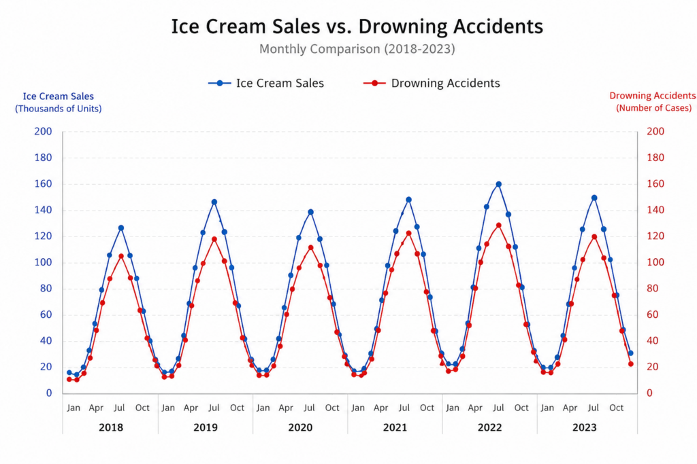
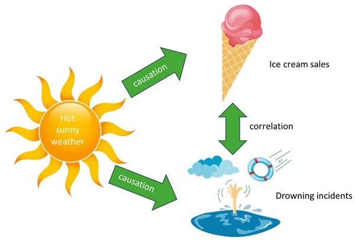
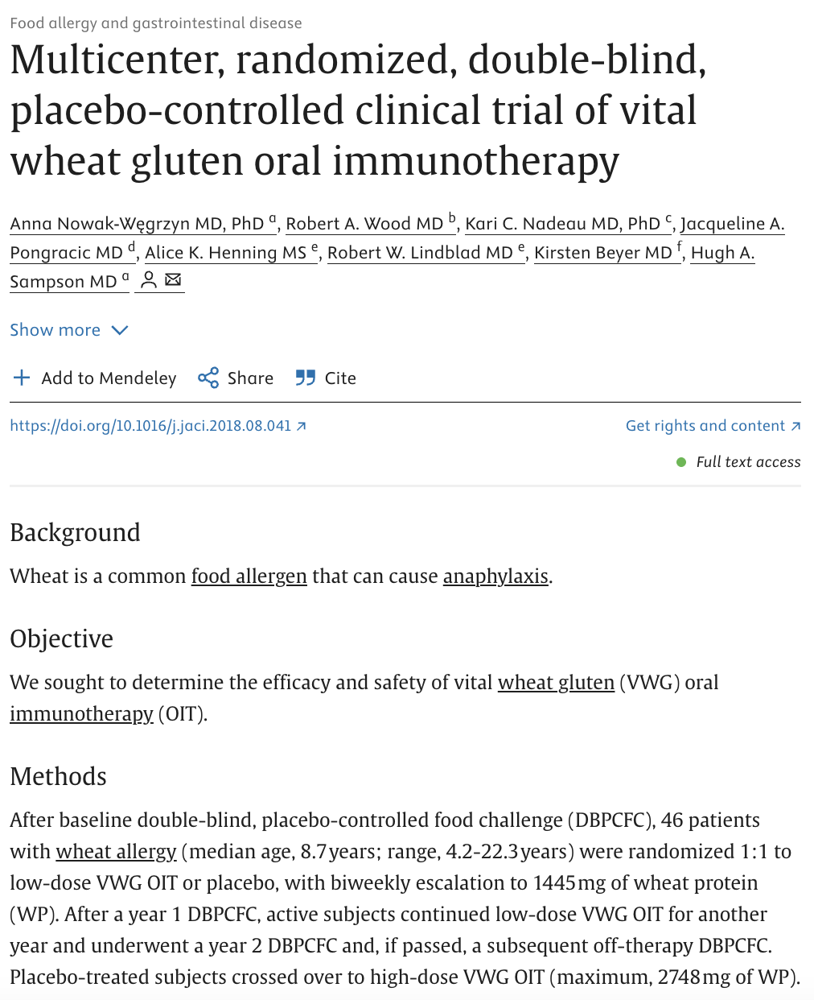

```{r}
#| label: load-packages
#| message: false
#| echo: false
library(tidyverse)
library(tidymodels)
library(openintro)
library(knitr)
todays_ae <- "ae-20"

set.seed(42)
n <- 46
wheat_trial <- tibble(
  id                = 1:n,
  age               = round(runif(n, 4, 22), 1),
  baseline_wheat_ige = round(rexp(n, rate = 1/30), 1),
  vwg_oit           = c(rep(1, 23), rep(0, 23))
) |>
  mutate(
    max_dose_mg = pmax(0, round(
      150 + 950 * vwg_oit - 3 * baseline_wheat_ige + 12 * age + rnorm(n, sd = 90)
    ))
  )
```

# The problem of causality

## Correlation ≠ causation

::: incremental
- So far, we have said to "avoid" causal language when describing the relationship between two variables
- Why? Because only in certain circumstances can we conclude causality
- Variables can be heavily correlated (remember Nicolas Cage) but clearly not causal
- These next two lectures explore some of the circumstances in which we can say "A causes B"
:::

## What's going on here

{width="70%" fig-align="center"}

## Well yes

{width="70%" fig-align="center"}

## Confounding variables {.medium}

::: incremental
- A **confounding variable** is an outside variable that affects both variables of interest, creating a false association between them
- Students who live in Hollows have more free time in the second semester → the confounder is **senior status**
- Athletes with larger caloric intake are more likely to have knee problems → the confounder is **height/body size**
- Come up with your own!
:::

## So how do we deal with confounding variables? {.medium}

We can deal with confounders **before** or **after** we collect the data.

::: columns
::: {.column width="50%"}
**Design**

-   Meticulously plan your data collection and treatment assignment
-   Eliminate possible confounder effects from the start
-   Example: **randomize** who gets treatment so groups start out comparable
:::

::: {.column width="50%"}
**Modeling / Analysis**

-   Collect your data, then adjust for confounders statistically
-   Include confounders as covariates in a regression model
-   Example: **control for** age and sex when estimating a treatment effect
:::
:::

## Key takeaway

::: incremental
- Confounding variables make it hard to conclude that $A$ *causes* $B$

- But if we can **remove or account for** the effects of confounding — either by design or by modeling — we *can* conclude causality

:::

# Randomized Experiments

## What is a randomized experiment?

::: incremental
-   A study in which the researcher **assigns** units (people, schools, hospitals, ...) to treatment or control

-   Assignment uses a **random mechanism** — like a coin flip — not the unit's own choice or the researcher's judgment

-   This is in contrast to an **observational study**, where we observe but do not intervene

-   Examples: clinical drug trials, A/B tests, policy evaluations
:::

## Some definitions

::: incremental
-   $Z \in \{0, 1\}$: **treatment indicator** — 1 if a unit receives treatment, 0 if control

-   $X$: **covariates** — pre-treatment background variables (age, sex, baseline health, ...)

-   $Y$: **outcome** — the quantity we want to understand causally (recovery, test score, revenue, ...)

-   **Treatment group**: units assigned $Z = 1$

-   **Control group**: units assigned $Z = 0$
:::

## Some jargon you'll hear

::: incremental
-   **Placebo**: a "fake" treatment (e.g., a sugar pill) given to the control group; indistinguishable from the real treatment

-   **Single-blind**: participants do not know their treatment assignment

-   **Double-blind**: neither participants nor the researchers administering treatment know the assignment — guards against bias on both sides
:::

##

{width="50%" fig-align="center"}

<https://pubmed.ncbi.nlm.nih.gov/30389226/>

## Your turn {.smaller}

::: task
Using the paper (<https://pubmed.ncbi.nlm.nih.gov/30389226/>), identify the following:

-   **Cohort**: Who are the study participants?
-   **Design**: How was the data collected?
-   **Treatment and control** ($Z$): What did each group receive?
-   **Outcome** ($Y$): What is being measured?
-   **Covariates** ($X$): What pre-treatment variables were recorded?
:::

## Example: The Wheat OIT Study {.smaller}

Nowak-Węgrzyn et al., *Journal of Allergy and Clinical Immunology* (2019) — <https://pubmed.ncbi.nlm.nih.gov/30389226/>

::: incremental
-   **Cohort**: 46 children and young adults (ages 4–22) with confirmed wheat allergy

-   **Design**: Multicenter, randomized, **double-blind**, placebo-controlled Phase 2 trial

-   **Treatment** ($Z=1$): Vital wheat gluten (VWG) oral immunotherapy — biweekly escalation to 1,480 mg wheat protein/day over 1 year

-   **Control** ($Z=0$): Matched **placebo** — participants and researchers blinded to assignment

-   **Outcome** ($Y$): Passing a 1,480 mg double-blind placebo-controlled food challenge (DBPCFC) at year 1

-   **Covariates** ($X$): Age, sex, baseline wheat IgE, threshold dose at baseline
:::

## The gold standard {.medium}

Randomization is incredibly powerful

::: incremental
-   Treatment $Z$ is assigned **independently of everything**: $Z \perp X$

-   This includes **measured** confounders *and* **unmeasured** confounders

-   Even if confounders exist, they are distributed (in expectation) evenly across both groups — so they don't bias our estimate

-   Any average difference in $Y$ between groups must be due to $Z$, not a confounder

-   This is why RCTs are considered the **gold standard** for causal inference
:::

## Checking randomization: Covariate Balance

::: incremental
-   Randomization creates **two comparable groups** — the only systematic difference should be the treatment itself

-   We verify this empirically with a **balance table** (called "Table 1" in medical research)

-   Compare means and proportions of key pre-treatment covariates across the two groups

-   Good balance → confident that differences in $Y$ are attributable to $Z$
:::

## Table 1: Wheat OIT Study {.smaller}

| Characteristic | Placebo (n = 23) | VWG OIT (n = 23) |
|---|:---:|:---:|
| Age (years), mean (SD) | 8.1 (3.9) | 7.8 (4.1) |
| Female, $n$ (%) | 9 (39%) | 10 (43%) |
| Wheat IgE (kU/L), median | 31.4 | 29.8 |
| Threshold dose at baseline (mg), median | 200 | 200 |

::: incremental
-   Groups look similar on all pre-treatment characteristics
-   This is exactly what we expect under randomization
:::

## When covariate balance is violated... {.medium}

::: incremental
-   If groups differ on $X$ *before* treatment, we can't be sure whether differences in $Y$ are due to $Z$ or $X$

-   Example: if the treatment group happens to be younger on average, better outcomes might reflect age — not the treatment

-   **Solution 1**: include the imbalanced covariate(s) in your regression model

-   **Solution 2**: **rerandomize** — if the initial draw produces an imbalanced allocation, redraw until balance is achieved (can be built into the design ahead of time)
:::

## Ok, so we have balance, now what?

::: incremental
-   Now our question is: does the change in our treatment affect our outcome $Y$?

-   I.e., does switching from the control group to our treatment group produce a meaningful change in $Y$ on average?

-   We can estimate this directly as the **difference in group means**:

    $$\tau = \bar{Y}_{\text{treated}} - \bar{Y}_{\text{control}}$$
:::

## Linear regression with a binary treatment

$$Y_i = \widehat{\beta_0} + \widehat{\beta_1} Z_i + \varepsilon_i$$

::: incremental
-   $\widehat{\beta_0}$: predicted outcome in the **control group** ($Z = 0$)

-   $\widehat{\beta_1}$: estimated **average treatment effect** — the average change in $Y$ when going from control to treatment

-   In fact, $\widehat{\beta_1} = \bar{Y}_{\text{treated}} - \bar{Y}_{\text{control}}$ exactly
:::

## Data: Wheat OIT Trial {.smaller}

```{r}
#| echo: true
glimpse(wheat_trial)
```

::: callout-note
This dataset is **artificially generated** to represent the structure of the real study. In practice, clinical trial data like this is **Protected Health Information (PHI)** — individually identifiable health data (e.g. diagnoses, lab values, treatment records) protected under HIPAA — and cannot be shared publicly.
:::

## Research question

Is VWG oral immunotherapy effective at increasing wheat tolerance?

. . .

More precisely: is there a significant relationship between VWG OIT treatment and maximum tolerated wheat protein dose?

. . .

$$H_0: \beta_1 = 0 \qquad H_A: \beta_1 \neq 0$$

## Visualize {.smaller}

```{r}
#| echo: true
#| output-location: column
#| message: false
ggplot(
  wheat_trial,
  aes(
    x = factor(vwg_oit, labels = c("Placebo", "VWG OIT")),
    y = max_dose_mg
  )
) +
  geom_boxplot() +
  labs(
    x = "Treatment group",
    y = "Max tolerated dose (mg)",
    title = "Max wheat dose by treatment"
  )
```

```{r}
#| echo: true
#| output-location: column
wheat_trial |>
  group_by(vwg_oit) |>
  summarise(
    n        = n(),
    mean_dose = mean(max_dose_mg),
    sd_dose  = sd(max_dose_mg)
  )
```

## Model fit {.smaller}

```{r}
#| echo: true
wheat_fit <- linear_reg() |>
  fit(max_dose_mg ~ vwg_oit, data = wheat_trial)

tidy(wheat_fit)
```

## Model interpret {.smaller}

$$\widehat{\text{max dose}} = \widehat{\beta_0} + \widehat{\beta_1} \times \text{VWG OIT}$$

-   **Intercept**: The estimated max tolerated dose for participants in the **placebo group** is $\widehat{\beta_0}$ mg, on average.

-   **`vwg_oit`**: Receiving VWG OIT **causes** an estimated increase of $\widehat{\beta_1}$ mg in max tolerated dose compared to placebo, on average.

## Wait — our interpretation changed! {.medium}

::: incremental
-   In every previous lecture, we said: *"For a one-unit increase in X, Y is **predicted** to change by $\widehat{\beta_1}$, on average."*

-   Here, we used the word **causes** instead of *predicted*

-   Why can we do that now?

-   Because $Z$ was **randomly assigned** — not chosen by participants, not influenced by their health or preferences

-   Randomization breaks every back-door path from confounders to $Z$, so the only explanation for a difference in $Y$ between groups **is** the treatment

-   This is exactly what an RCT buys us: the license to say *causes*
:::

## Computing the CI for the treatment effect I {.scrollable}

Calculate the observed fit:

```{r}
#| echo: true
observed_fit <- wheat_trial |>
  specify(max_dose_mg ~ vwg_oit) |>
  fit()

observed_fit
```

## Computing the CI for the treatment effect II {.smaller .scrollable}

Take 1000 bootstrap samples and fit models to each one:

```{r}
#| echo: true
#| code-line-numbers: "1,5,6"
set.seed(1120)

boot_fits <- wheat_trial |>
  specify(max_dose_mg ~ vwg_oit) |>
  generate(reps = 1000, type = "bootstrap") |>
  fit()

boot_fits
```

## Computing the CI for the treatment effect III

```{r}
#| echo: true
#| code-line-numbers: "4,5"
get_confidence_interval(
  boot_fits,
  point_estimate = observed_fit,
  level = 0.95,
  type = "percentile"
)
```

Is this result significant? How can we conclude signficance from confidence interval?

## Setting hypotheses

-   **Null hypothesis**, $H_0$: The slope predicting max tolerated dose from VWG OIT is 0 — treatment has no effect, $\beta_1 = 0$.

-   **Alternative hypothesis**, $H_A$: The slope is not 0 — VWG OIT has a significant effect on max tolerated dose, $\beta_1 \neq 0$.

## Simulate null distribution

```{r, cache=TRUE}
#| echo: true
#| warning: false
#| message: false
#| code-line-numbers: "|1|2|3|4|5|6"
set.seed(24601)
null_dist <- wheat_trial |>
  specify(max_dose_mg ~ vwg_oit) |>
  hypothesize(null = "independence") |>
  generate(reps = 1000, type = "permute") |>
  fit()
```

## Visualize null distribution

```{r}
#| echo: true
#| warning: false
#| message: false
visualize(null_dist) +
  shade_p_value(obs_stat = observed_fit, direction = "two-sided")
```

## Get p-value

```{r}
#| echo: true
#| warning: false
#| message: false
null_dist |>
  get_p_value(obs_stat = observed_fit, direction = "two-sided")
```

## Make a decision {.medium}

::: task
Based on the p-value, what is the conclusion of the hypothesis test?
:::

::: incremental
-   Since $p < 0.05$, we reject $H_0$

-   We have sufficient evidence of a statistically significant relationship between VWG OIT and maximum tolerated wheat protein dose

-   More precisely: we have evidence that **receiving VWG OIT causes an increase in maximum tolerated wheat protein dose**
:::

## Further covariate adjustment

If covariate balance is not satisfied, we can include those covariates in the model to **adjust for them**:

```{r}
#| echo: true
wheat_fit_adj <- linear_reg() |>
  fit(max_dose_mg ~ vwg_oit + baseline_wheat_ige, data = wheat_trial)

tidy(wheat_fit_adj)
```

## Limitations of RCTs {.smaller}

::: incremental
-   **Generalizability**: The wheat OIT trial enrolled 46 children and young adults at a small number of academic medical centers — results may not generalize to all ages, allergy severities, or healthcare settings

-   **Feasibility and cost**: RCTs require careful coordination, long follow-up periods, and significant funding — not every research question can be studied this way

-   **Ethical constraints**: We can only randomize participants to treatments we believe are plausibly safe — we cannot randomly assign people to harmful exposures

    -   Example: we cannot randomize children *without* wheat allergies to *develop* an allergy just to study the effect
    -   Borderline cases (e.g., deliberately inducing allergic reactions in a food challenge) require careful IRB oversight and informed consent
:::

## Application Exercise

`r todays_ae`

## Bonus

